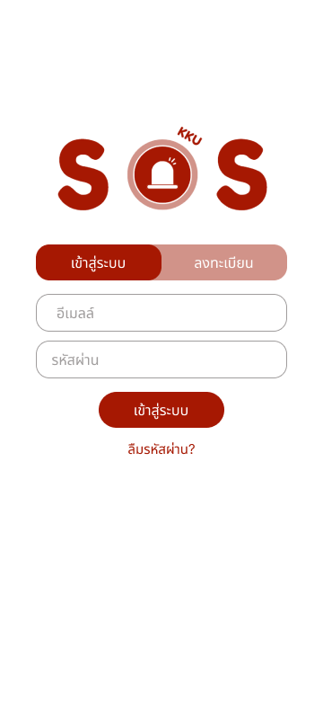
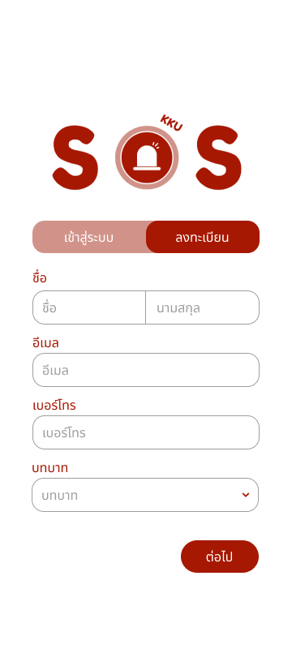
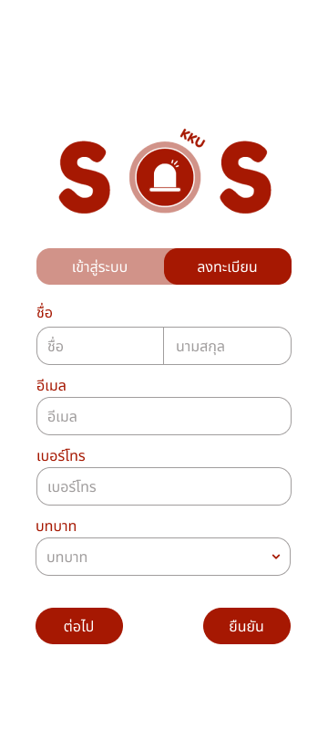
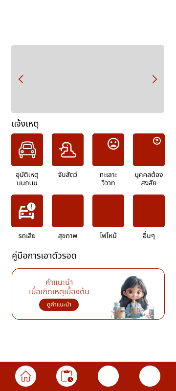
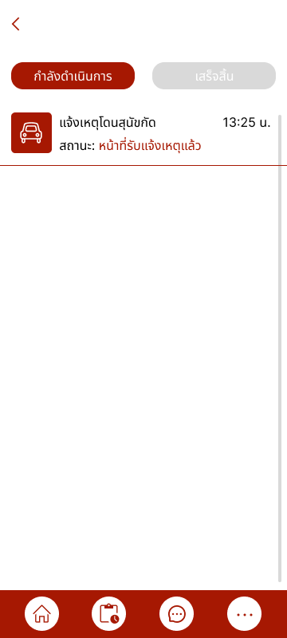
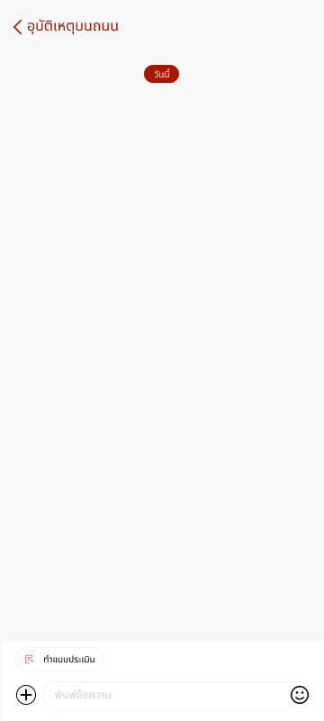
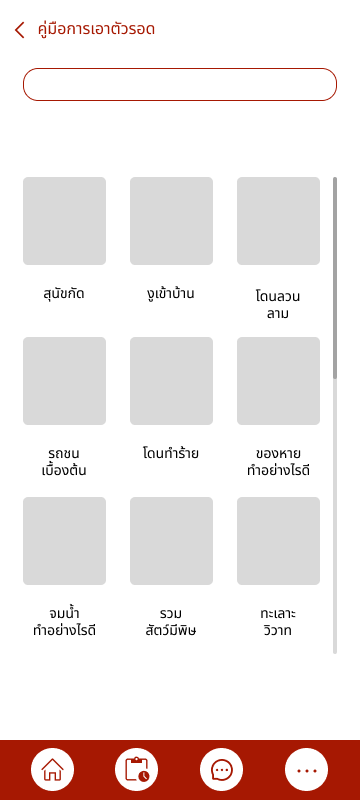
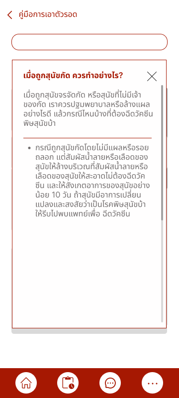
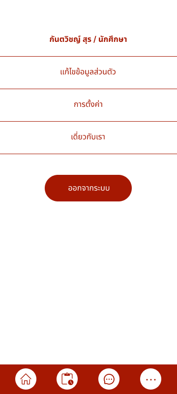

# KKU Emergency

A dual Android application system for emergency incident reporting and management at Khon Kaen University (KKU). The platform connects students, staff, and the general public with emergency responders through real-time incident reporting, live chat communication, and a coordinated dispatch workflow — all backed by Firebase services for authentication, real-time database, and push notifications.

## Table of Contents

- [Features](#features)
- [Screenshots](#screenshots)
- [Tech Stack](#tech-stack)
- [Project Structure](#project-structure)
- [Getting Started](#getting-started)
- [Database Schema](#database-schema)
- [Firestore Operations](#firestore-operations)
- [Role-Based Access](#role-based-access)

## Features

### Client-Facing (KKUEmergencyClient)

- **Incident Reporting** — Submit emergency reports with incident type, location, relation to victim, and additional details.
- **Real-Time Status Tracking** — Monitor incident status updates live (Pending, Accepted, In Progress, Completed).
- **In-App Chat** — Communicate directly with the assigned emergency staff member.
- **Survival Guides** — Browse emergency survival guides filtered by incident type with images and detailed instructions.
- **Account Management** — Register with role selection (Student / Staff / General), update profile, and reset password.
- **Phone Call to Staff** — Call the assigned staff member directly from the incident detail screen.

### Staff / Responder (KKUEmergencyStaff)

- **Incident Dashboard** — View all unassigned and active incidents with search and type-based filtering.
- **Incident Assignment** — Accept and self-assign unassigned incidents.
- **Status Management** — Update incident status through the full lifecycle (Pending → Accepted → In Progress → Completed).
- **Chat with Reporter** — Real-time messaging with the person who reported the incident.
- **Push Notifications** — Receive FCM push alerts for new incidents, new messages, and status changes.
- **Profile & Availability** — Toggle availability status (Available / Working), edit profile, and manage password.

### System / Infrastructure

- **Firebase Authentication** — Secure email/password authentication for both apps with role validation.
- **Cloud Firestore** — Real-time NoSQL database with snapshot listeners for live data updates.
- **Firebase Cloud Messaging** — Push notification delivery to staff devices for new incidents and messages.
- **Koin Dependency Injection** — Clean DI architecture in the Staff app for repositories and view models.

## Screenshots

| Login | Register Step 1 | Register Step 2 |
|:---:|:---:|:---:|
|  |  |  |

| Home | Report Incident | Report Step 1 |
|:---:|:---:|:---:|
|  |  |  |

| Report Step 2 | Report Step 3 | Incident Status |
|:---:|:---:|:---:|
|  |  |  |

| Chat | Survival Guides | Guide Detail |
|:---:|:---:|:---:|
|  |  |  |

| Profile & Settings |
|:---:|
|  |

## Tech Stack

| Layer | Technology |
|---|---|
| **Language** | Kotlin |
| **Client App SDK** | Android API 24–34 (compileSdk 34) |
| **Staff App SDK** | Android API 27–35 (compileSdk 35) |
| **Architecture** | MVVM (Model-View-ViewModel) |
| **UI Toolkit** | Android XML Layouts + Jetpack Compose (Staff app) |
| **View Binding** | ViewBinding & DataBinding |
| **Authentication** | Firebase Authentication (email/password) |
| **Database** | Cloud Firestore (real-time NoSQL) |
| **Push Notifications** | Firebase Cloud Messaging (FCM) |
| **Dependency Injection** | Koin 3.4.0 (Staff app) |
| **Image Loading** | Glide 4.16.0 (Client app) |
| **Image Slider** | ImageSlideshow 0.1.0 (Client app) |
| **Maps** | Google Play Services Maps 18.1.0 (Staff app) |
| **Material Design** | Material Components for Android |
| **Build System** | Gradle (Groovy for Client, Kotlin DSL for Staff) |
| **Java Compatibility** | Java 11 |

## Project Structure

```
KKUEmergency/
├── doc/
│   └── KKU Emergency.pdf              # Project documentation with screenshots
│
└── sourceCode/
    ├── KKUEmergencyClient/             # Client app (for public users)
    │   └── app/src/main/
    │       ├── java/com/example/sos/
    │       │   ├── models/             # Data classes (User, Incident, Message, etc.)
    │       │   ├── repository/         # Firestore data access layer
    │       │   ├── viewmodel/          # MVVM ViewModels
    │       │   ├── adapter/            # RecyclerView adapters
    │       │   ├── home/               # Home screen activity
    │       │   ├── login/              # Login fragment
    │       │   ├── register/           # Two-step registration fragments
    │       │   ├── report/             # Incident reporting activity
    │       │   ├── account/            # User profile management
    │       │   ├── message/            # Chat room list
    │       │   ├── chat/               # Chat messaging screen
    │       │   ├── pending/            # Active/completed incidents list
    │       │   ├── guides/             # Survival guides browser
    │       │   └── MainActivity.kt     # Entry point with login/register tabs
    │       └── res/                    # Layouts, drawables, strings, colors
    │
    └── KKUEmergencyStaff/              # Staff app (for emergency responders)
        └── app/src/main/
            ├── java/com/example/sosstaff/
            │   ├── models/             # Data classes (StaffUser, Incident, ChatRoom, etc.)
            │   ├── auth/               # Login activity, ViewModel, and AuthRepository
            │   ├── main/
            │   │   ├── MainContainer.kt      # Bottom navigation host
            │   │   ├── incidents/            # Incident list, detail, and status management
            │   │   ├── chat/                 # Chat rooms list and messaging
            │   │   └── profile/              # Staff profile and availability
            │   ├── common/
            │   │   ├── di/                   # Koin dependency injection modules
            │   │   └── utils/                # Notification helpers and utilities
            │   ├── services/                 # FCM messaging service
            │   ├── SosStaffApplication.kt    # Application class (Koin init)
            │   └── MainActivity.kt           # Splash + auth check entry point
            └── res/                          # Layouts, drawables, strings, colors
```

## Getting Started

### Prerequisites

- **Android Studio** Hedgehog (2023.1.1) or newer
- **JDK 11** or higher
- **Android SDK** with API level 35 installed
- A **Firebase project** with Authentication, Cloud Firestore, and Cloud Messaging enabled
- A physical device or emulator running **Android 7.0+ (API 24)** for the Client app, or **Android 8.1+ (API 27)** for the Staff app

### Installation

1. **Clone the repository**

   ```bash
   git clone https://github.com/<your-username>/KKUEmergency.git
   cd KKUEmergency
   ```

2. **Set up Firebase**

   - Create a Firebase project at [console.firebase.google.com](https://console.firebase.google.com)
   - Enable **Email/Password** authentication
   - Create a **Cloud Firestore** database
   - Enable **Cloud Messaging**
   - Download `google-services.json` for each app:
     - Register Android app with package `com.example.sos` → place in `sourceCode/KKUEmergencyClient/app/`
     - Register Android app with package `com.example.sosstaff` → place in `sourceCode/KKUEmergencyStaff/app/`

3. **Seed the Firestore database**

   Create the following collections in Firestore:
   - `users` — populated automatically on client registration
   - `staff` — manually add staff documents with fields: `name`, `email`, `phone`, `position`, `status`, `fcmToken`, `lastActiveAt`, `createdAt`
   - `incidents` — populated automatically on incident reports
   - `chats` — populated automatically with incidents
   - `messages` — populated automatically in chat
   - `survivalGuides` — manually add guide documents with fields: `title`, `content`, `incidentType`, `imageUrl`, `createdAt`, `updatedAt`

4. **Open in Android Studio**

   - Open `sourceCode/KKUEmergencyClient` as a project for the Client app
   - Open `sourceCode/KKUEmergencyStaff` as a project for the Staff app

5. **Build and run**

   ```bash
   # Client app
   cd sourceCode/KKUEmergencyClient
   ./gradlew assembleDebug

   # Staff app
   cd sourceCode/KKUEmergencyStaff
   ./gradlew assembleDebug
   ```

### Available Gradle Tasks

| Task | Description |
|---|---|
| `./gradlew assembleDebug` | Build debug APK |
| `./gradlew assembleRelease` | Build release APK |
| `./gradlew build` | Full build with checks |
| `./gradlew test` | Run unit tests |
| `./gradlew connectedAndroidTest` | Run instrumented tests on device/emulator |
| `./gradlew lint` | Run Android lint checks |
| `./gradlew clean` | Clean build outputs |

## Role-Based Access

| Role | App | Access | Description |
|---|---|---|---|
| **Student** (`นักศึกษา`) | Client | Full client features | KKU students who can report incidents and chat with staff |
| **University Staff** (`บุคลากร`) | Client | Full client features | KKU personnel who can report incidents and chat with staff |
| **General Public** (`บุคคลทั่วไป`) | Client | Full client features | Non-KKU individuals who can report incidents and chat with staff |
| **Emergency Staff** | Staff | Full staff features | Emergency responders who manage incidents, chat, and receive notifications |

### How Authorization Works

1. **Separate apps, separate access** — The Client and Staff apps are completely separate Android applications. Each app authenticates against a different Firestore collection (`users` vs `staff`).

2. **Firebase Authentication** — Both apps use Firebase email/password authentication. On login, the Staff app performs an additional check to verify the user's UID exists in the `staff` collection; if not, the user is signed out and denied access.

3. **Data isolation via queries** — Client users can only see their own incidents (queries filter by `reporterId == currentUserId`). Staff members see all incidents but can only be assigned to ones they accept.

4. **FCM token management** — Staff FCM tokens are stored on login and cleared on logout, ensuring push notifications are only delivered to actively authenticated staff devices.

5. **Chat room binding** — Chat rooms are created alongside incidents and bound to the reporter's UID. Staff members access chats through assignment, ensuring only the assigned responder communicates with the reporter.

---

## License

This project was developed as part of a coursework project at Khon Kaen University.
